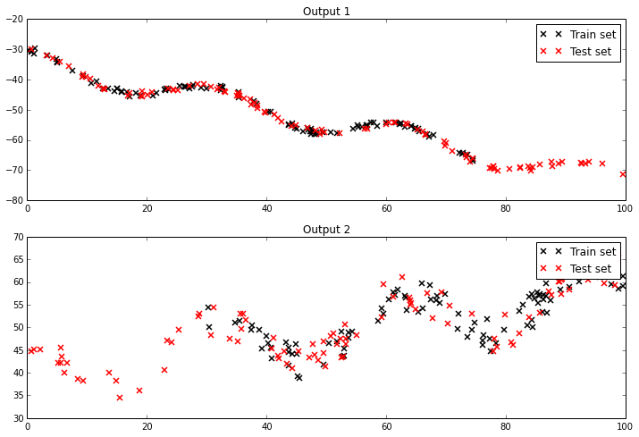
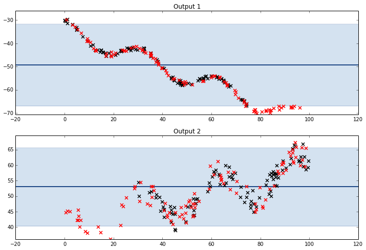
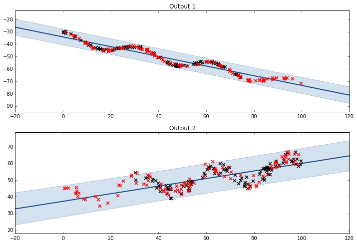
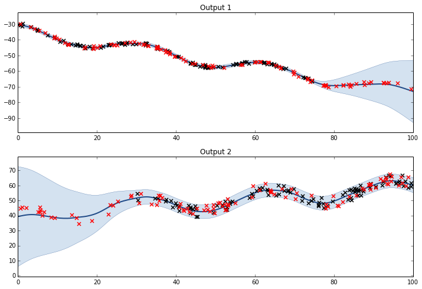

<!-- toc -->
# Coregionalized Regression with GPy
(also called multi-task GP)
Based on [Coregionalized regression model tutorial by Ricardo Andrade-Pacheco, 2015, June 17, ipynb](http://nbviewer.ipython.org/github/SheffieldML/notebook/blob/master/GPy/coregionalized_regression_tutorial.ipynb)

## Basic procedure

```python
import pylab as pb
import GPy
import numpy as np

pb.interactive(False)
```
Generate artificial dataset:
```python
#This functions generate data corresponding to two outputs
f_output1 = lambda x: 4. * np.cos(x/5.) - .4*x - 35. + np.random.rand(x.size)[:,None] * 2.
f_output2 = lambda x: 6. * np.cos(x/5.) + .2*x + 35. + np.random.rand(x.size)[:,None] * 8.


#{X,Y} training set for each output
X1 = np.random.rand(100)[:,None]; X1=X1*75
X2 = np.random.rand(100)[:,None]; X2=X2*70 + 30
Y1 = f_output1(X1)
Y2 = f_output2(X2)
#{X,Y} test set for each output
Xt1 = np.random.rand(100)[:,None]*100
Xt2 = np.random.rand(100)[:,None]*100
Yt1 = f_output1(Xt1)
Yt2 = f_output2(Xt2)
```
Two datasets look like this:


---
A multiple output kernel is defined and optimized as:
```python
K = GPy.kern.Matern32(1)
icm = GPy.util.multioutput.ICM(input_dim=1, num_outputs=2, kernel=K)
m = GPy.models.GPCoregionalizedRegression([X1, X2], [Y1, Y2], kernel=icm)
#For this kernel, B.kappa encodes the variance now.
m['.*Mat32.var'].constrain_fixed(1.) 
m.optimize()
print m
```

## Kernel Selection for Improvement
The data from both outputs is not centered on zero. A way of dealing with outputs of different means or magnitudes is using a `bias kernel`. This kernel is just changing the mean (constant) of the Gaussian Process being fitted. 

### Only Mean (ICM)
There is no need to assume any sort of correlation between both means, so we can define $${\bf W} = {\bf 0}$$. 

```python
kernel = GPy.util.multioutput.ICM(input_dim=1,num_outputs=2,kernel=GPy.kern.Bias(input_dim=1))
m = GPy.models.GPCoregionalizedRegression(X_list=[X1,X2],Y_list=[Y1,Y2],kernel=kernel)
#B.kappa now encodes the variance.
m['.*bias.var'].constrain_fixed(1) 
m['.*W'].constrain_fixed(0)
m.optimize()
```



### Mean & Linear Trend (LCM)
$${\bf K}_{LCM} = {\bf B}_1 \otimes {\bf K}_{Bias} + {\bf B}_2 \otimes {\bf K}_{Linear}$$.

```python
K1 = GPy.kern.Bias(1)
K2 = GPy.kern.Linear(1)
lcm = GPy.util.multioutput.LCM(input_dim=1,num_outputs=2,kernels_list=[K1,K2])

m = GPy.models.GPCoregionalizedRegression([X1,X2],[Y1,Y2],kernel=lcm)
m['.*bias.var'].constrain_fixed(1.)
m['.*W'].constrain_fixed(0)
m['.*linear.var'].constrain_fixed(1.)
m.optimize()
```


### Full model with Matern32 kernel

```python
K1 = GPy.kern.Bias(1)
K2 = GPy.kern.Linear(1)
K3 = GPy.kern.Matern32(1)
lcm = GPy.util.multioutput.LCM(input_dim=1,num_outputs=2,kernels_list=[K1,K2,K3])

m = GPy.models.GPCoregionalizedRegression([X1,X2],[Y1,Y2],kernel=lcm)
m['.*ICM.*var'].unconstrain()
m['.*ICM0.*var'].constrain_fixed(1.)
m['.*ICM0.*W'].constrain_fixed(0)
m['.*ICM1.*var'].constrain_fixed(1.)
m['.*ICM1.*W'].constrain_fixed(0)
m.optimize()
```




## Prediction at new input values
This model is using an extended input space with an additional dimension that points at the output each data point belongs to. In other words, we need an extra column to describe which `task` the data belongs to. 

To make use of the prediction function of GPy, this model needs the input array to have the extended format. For example if we want to make predictions in the region 100 to 100 for the second output, we need to define the new inputs as follows:

```python
newX = np.arange(100,110)[:,None]
newX = np.hstack([newX,np.ones_like(newX)])
print newX
```

We also need to pass another output to the predict function. This is an array that tells which `noise model` is associated to each point to be predicted. This is a dictionary constructed as follows:

```python
noise_dict = {'output_index':newX[:,1:].astype(int)}
```

The `astype(int)` function is to ensure that the values of the dictionary are integers, otherwise the Python complains when using them as indices. Then prediction is command can then be called this way:
```python
m.predict(newX,Y_metadata=noise_dict)
```
