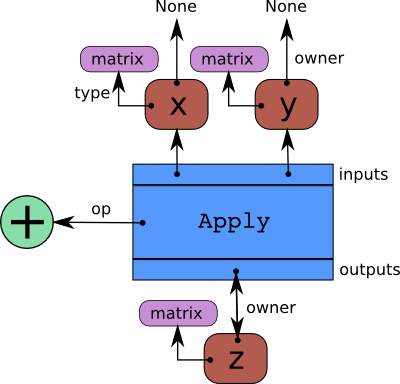

<!-- toc -->

> adapted from http://deeplearning.net/software/theano/tutorial/

# Theano Tutorial

## Basic Algebra

### Adding two scalars
```python
import theano.tensor as T
from theano import function
x = T.fscalar('x')
y = T.fscalar('y')
```
By calling `T.dscalar` with a string argument, we create a *variable* representing a floating-point scalar quantity with the given name. 
```python
z = x + y
```
z is another *variable* representing the addition of x and y. We can use `pp` function to pretty-print out the computation associate with z:
```python
from theano import pp
print(pp(z))
```
The last step is to create a function taking x and y as inputs and giving z as output:
```python
f = function([x, y], z)
```
The first argument to function is a list of variables that will be provided as inputs to the function. The second argument is a single variable or a list of variables. For either case, the second argument is what we want to see as output when we apply the function. f may then be used like a normal Python function.

### Adding two matrices
```python
x = T.fmatrix('x')
y = T.fmatrix('y')
z = x + y
f = function([x, y], z)
```

## More examples

http://deeplearning.net/software/theano/tutorial/examples.html

### Logistic function
For logistic function, $$s(x)=\frac{1}{1+e^{-x}}$$:
```python
x = T.fmatrix('x')
s = 1 / (1 + T.exp(-x))
# even for ONE argument, we have to use []
logistic = function([x], s)
```
### Setting a default value for an argument
```python
from theano import Param
x, y = T.fscalars('x', 'y')
z = x + y
f = function([x, Param(y, default=1)], z)
f(10)
```

### Using shared variables
For example, we want to make an *accumulator*: at the beginning, the state is initialized to zero. Then, on each function call, the state is incremented by the function's argument. 

Let's first define the *accumulator* function. It adds its argument to the internal state, and returns the **OLD** state value:
```python
from theano import shared
state = shared(0)
inc = T.iscalar('inc')
accumulator = function([inc], state, updates=[(state, state+inc)])
```
The `shared` function constructs *shared variables*. Their value may be shared between multiple functions. The value can be accessed and modified by `.get_value()` and `.set_value()` methods. 

As a parameter of `function`, `updates` must be supplied with a list of pairs of the form (shared-variable, new expression). It can also be a dictionary whose keys are shared-variables and values are the new expressions. It means "whenever this function runs, it will replace the `.value` of each shared variable with the result of the corresponding expression". Above, the accumulator replaces the `state` value with the sum of the state and the increment amount. 

`.set_value()` can be used to reset the state. 

Why we need `theano.shared`? For efficiency. Updates to shared variables can sometimes be done more quickly using in-place algorithms. Also, Theano has more control over where and how shared variables are allocated, which is important for GPU. 

### Using random numbers
The way to think about putting randomness into Theano's computations is to put random variables in the graph. Theano will allocate a Numpy RandomStream object (a random number generator) for each such variable, and draw from it as necessary. This sort of sequence of random numbers are called a random stream. Random streams are at their core *shared variables*, so the observations on shared variables hold here as well. 

An example is:
```python
from theano.tensor.shared_randomstreams import RandomStreams
from theano import function
srng = RandomStreams(seed=234)
rv_u = srng.uniform((2,2))
rv_n = srng.normal((2, 2))
f = function([], rv_u)
g = funciton([], rv_n, no_default_updates=True) # not updating rv_n.rng
nearly_zeros = function([], rv_u + rv_u - 2 * rv_u)
```
`rv_u` is a random straem of 2x2 matrices of draws from a uniform distribution. `rv_n` is a random stream of 2x2 matrices of draws from a normal distribution. 

An important remark is that a ranodm variable is drawn `at most once` during any single function execution. So the `nearly_zeros` function is guaranteed to return approximately 0 even though the `rv_u` random variable appears three times in the output expression. 

####seeding streams
We can seed one random variable by seeding or assigning to the `.rgn` attribute, using `.rng.set_value()`
```python
rng_val = rv_u.rng.get_value(borrow=True) # get the rng for rv_u
rng_val.seed(12345) # seed the generator
rv_u.rng.set_value(rng_val, borrow=True) # assign back seeded rng
```

####sharing streams between functions
a bit TRICKY example

```python
state_after_v0 = rv_u.rng.get_value().get_state()
v0 = f()
v1 = f()
rng = rv_u.rng.get_value(borrow=True)
rng.set_state(state_after_v0)
rv_u.rng.set_value(rng, borrow=True)

v2 = f() # v2 == v0
v3 = f() # v3 == v1
```

#### Copying random state between Theano graphs

## Graph structures

The first step in writing Theano code is to write down all mathematical relations using symbolic placeholders (variables). When writing down these expressions you use operations like +, -, **, sum(), tanh(). All these are represented internally as *ops*. An op represents a certain computation on some type of inputs producing some type of output. You can see it as a function definition in most programming languages.

Theano builds internally a graph structure composed of interconnected `variable` nodes, `op`nodes and `apply` nodes. An `apply` node represents the application of an `op` to some `variables`. 

```python
x = T.fmatrix('x')
y = T.fmatrix('y')
z = x + y
```



The graph can be traversed starting from outputs (the result of some computation) down to its inputs using the owner field. 

### Automatic differentiation
`tensor.grad()` will traverse the graph from the outputs back towards the inputs through all `apply` nodes (`apply` nodes are those that define which computations the graph does). For each such `apply` node, its `op` defines how to compute the `gradient` of the node's outputs with respect to its inputs. 

## Derivatives in Theano
### Computing the gradient
Say we want to compute $$d(x^2)/dx = 2 \cdot x$$ :
```python
from theano import pp
x = T.fscalar('x')
y = x ** 2
gy = T.grad(y, x)
print(pp(gy))
f = function([x], gy)
```
From `print(pp(gy))` we can see that `fill((x ** TensorConstant{2}), TensorConstant{1.0})`, which means to make a matrix of the same shame as `x**2` and fill it with `1.0`. 

### Computing the Jacobian
`Jacobian` designates the tensor comprising the first partial derivatives of the output of a function with respect to its inputs. `theano.gradient.jacobian()` will do it automatically

## Loop

### Simple loop with accumulation: computing $A^{k}$
Given k we want to get `A**k` using a loop:
```python
result = 1
for i in xrange(k):
	result = result * A
```
There are three things to notice: the initial value assigned to `result`, the accumulation of results in `result`, and the unchanging variable `A`. Unchanging variables are passed to `scan` as `non_sequences`. Initialization occurs in `outputs_info`, and the accumulation happens automatically. 

The equivalent Theano code is:
```python
k = T.iscalar('k')
A = T.vector('A')

result, updates = theano.scan(fn=lambda prior_result, A: prior_result * A, outputs_info=T.ones_like(A), non_sequences=A, n_steps=k)
# We only care about A**k, but scan has provided us with A**1 through A**k.
# Discard the values that we don't care about. Scan is smart enough to
# notice this and not waste memory saving them.
final_result = result[-1]

# compiled function that returns A**k
power = theano.function(inputs=[A,k],
		outputs=final_result, updates=updates)

print(power(range(10),2))
print(power(range(10),4))
```
Within `theano.scan`, the order of parameters to `fn` is fixed: the output of the prior call to `fn`(or the initial value, initially) is the first parameter, followed by all `non-sequences`. 

Next we initialize the output as a tensor with the same shape and dtype as `A`, filled with ones. We give `A` to `scan` as a `non-sequences` parameter and specify the number of steps `k` to iterate over our lambda expression. 

`theano.scan` returns a tuple containing our result (`result`) and a dictionary of updates (empty in this case). The result is a 3D tensor containing the value of `A**k` for each step. We want the last value so we compile a function to return just that. Due to the internal optimization, we don't have to worry if `A` or `k` is large. 

### Iterating over the first dimension of a tensor: Calculating a polynomial

`theano.scan` can iterate over the leading dimension of tensors (similar to `for x in a_list`). 

The tensor to be looped over should be provided to `scan` using the `sequence` keyword argument. 

Here’s an example that builds a symbolic calculation of a polynomial from a list of its coefficients:
```python
coefficients = theano.tensor.vector("coefficients")
x = T.scalar("x")

max_coefficients_supported = 10000

# Generate the components of the polynomial
components, updates = theano.scan(fn=lambda coefficient, power, free_variable: coefficient * (free_variable ** power),
                                  outputs_info=None,
                                  sequences=[coefficients, theano.tensor.arange(max_coefficients_supported)],
                                  non_sequences=x)
# Sum them up
polynomial = components.sum()

# Compile a function
calculate_polynomial = theano.function(inputs=[coefficients, x], outputs=polynomial)

# Test
test_coefficients = numpy.asarray([1, 0, 2], dtype=numpy.float32)
test_value = 3
print calculate_polynomial(test_coefficients, test_value)
print 1.0 * (3 ** 0) + 0.0 * (3 ** 1) + 2.0 * (3 ** 2)
```

There is no accumulation of results, we can set `outputs_info` to `None`. This indicates to `scan` that it doesn't need to pass the prior result to `fn`.

The general order of function parameters to `fn` is:

> sequences (if any), prior result(s) (if needed), non-sequences (if any)

In `sequences=[coefficients,T.arange(max_coefficients_supported)]`, `scan` will truncate to the **shortest** of them. 

### Simple accumulation into a scalar, ditching lambda
The following example stresses a pitfall to be careful: the initial `outputs_info` must be of a **shape similar to that of the output variable** generated at each iteration and moreover, it **must not involve an implicit downcast** of the latter. 
